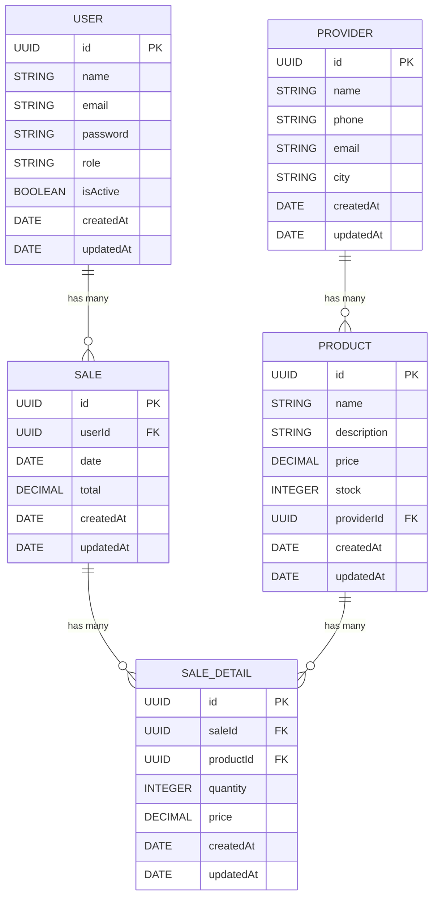

# Database Entity Relationship Diagram

This document contains the Entity-Relationship Diagram (ERD) for the supermarket-backend project, generated based on the updated models.

## Diagram

```mermaid
erDiagram
    PROVIDER ||--o{ PRODUCT : "has many"
    USER ||--o{ SALE : "has many"
    SALE ||--o{ SALE_DETAIL : "has many"
    PRODUCT ||--o{ SALE_DETAIL : "has many"

    PROVIDER {
        UUID id PK
        STRING name
        STRING phone
        STRING email
        STRING city
        DATE createdAt
        DATE updatedAt
    }

    PRODUCT {
        UUID id PK
        STRING name
        STRING description
        DECIMAL price
        INTEGER stock
        UUID providerId FK
        DATE createdAt
        DATE updatedAt
    }

    USER {
        UUID id PK
        STRING name
        STRING email
        STRING password
        STRING role
        BOOLEAN isActive
        DATE createdAt
        DATE updatedAt
    }

    SALE {
        UUID id PK
        UUID userId FK
        DATE date
        DECIMAL total
        DATE createdAt
        DATE updatedAt
    }

    SALE_DETAIL {
        UUID id PK
        UUID saleId FK
        UUID productId FK
        INTEGER quantity
        DECIMAL price
        DATE createdAt
        DATE updatedAt
    }
```

